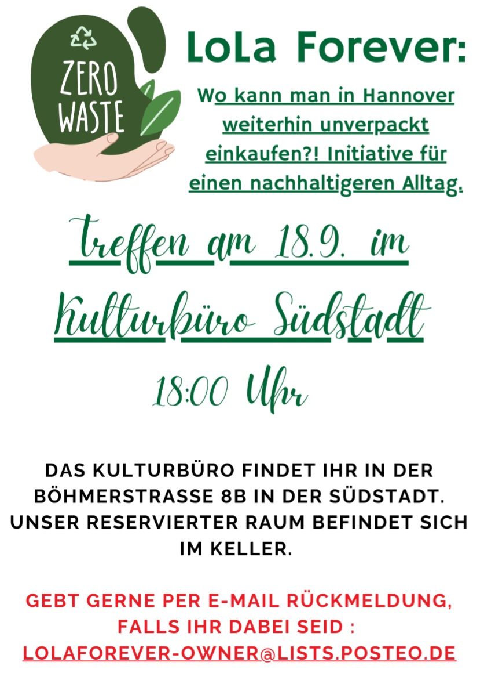

# LoLaForever
Unverpackt-Initiative in Hannovers Südstadt

## Willkommen
Hier koordiniert sich die ehemalige Stammkundschaft vom LoLa Loseladen in Hannovers Südstadt. Im Dezember 2024 hat der letzte Loseladen (von ehemals 3) in Hannover seine Türen geschlossen und seitdem müssen wir auf Alternativen ausweichen, um ökologisch produzierte und lose/unverpackte Waren zu kaufen. Der Onlineversand ist nicht die erste Wahl, denn die Dinge des täglichen Bedarfs sollten eigentlich vor Ort verfügbar sein. Falls das nicht möglich ist, ist durch Sammelbestellungen den Aufwand für Verpackung und Transport effizienter zu gestalten.

Dieses Dokument unterstützt Interessierte bei zwei Möglichkeiten ohne den Loseladen einzukaufen:
1. Wissen darüber, wo Lieblingsprodukte noch in Hannover verfügbar sind, austauschen
2. Interesse an Sammelbestellungen (insb. Großgebinde) ermitteln und ggfs. einleiten, um sie dann aufzuteilen

Andere Initiativen in Hannover sind bereits weiter mit ihrer Selbstorganisation und haben aus ähnlichen oder anderen Gründen Einkaufsgemeinschaften gegründet, die mglw. in der einen oder anderen Nachbarschaft, aber aktuell nicht in der Südstadt, existieren. Auf [hannover.de](https://www.hannover.de/Leben-in-der-Region-Hannover/Umwelt-Nachhaltigkeit/Naturschutz/Aufgaben-Projekte/Das-Agrikulturprogramm-f%C3%BCr-Hannover/Regionale-Einkaufstipps/Solidarische-Landwirtschaft-und-Einkaufsgemeinschaften2/Einkaufsgemeinschaften) findet ihr die bekanntesten.

Diese Initiativen gehören zu den aufwändigeren Möglichkeiten als Graswurzelbewegung Waren des täglichen Bedarfs zu beziehen. Es gibt aktuell keine Pläne so eine Initiative neu zu gründen, da es eine sehr engagierte Gruppe von Menschen braucht, um sie auf die Beine zu stellen. Der Kontakt über die Mailingliste [lolaforever@lists.posteo.de](mailto:lolaforever@lists.posteo.de) kann den passenden Rahmen bieten Gleichgesinnte zu finden, falls ihr daran Interesse habt.

Wenn es also keine eigene professionell betriebene Kooperative gibt, sind wir auf andere Formen der Selbstorganisation angewiesen. Ich möchte deshalb mit dem unkomplizierten Austausch über ein gemeinsam bearbeitbares Dokument starten. Das kann von allen bearbeitet werden, deshalb ist der Zugang momentan noch nicht öffentlich. Google Sheets ist bestimmt nicht die beste Lösung, aber vielen sicherlich bekannt.

Steven aus der Südstadt

## Newsletter
Neuigkeiten werden per Newsletter an eine Mailingliste versandt. Jede Person darf sich dazu selbstständig registrieren: [https://lists.posteo.de/listinfo/lolaforever](https://lists.posteo.de/listinfo/lolaforever)

Wer sich registriert, erhält Zugang zum Dokument bei Google Sheets und den Einladungslink zu einer Messengergruppe bei Signal.

## Treffen

Wir treffen uns monatlich in der Südstadt zum Austausch von Neuigkeiten, Diskussionen und auch losen Waren wie Lebensmitteln in Großgebinden.

## Einzelhandel

Die Liste der uns bekannten Läden, die Produkte in irgendeiner Form unverpackt, zum Abfüllen etc. anbieten, wird hier veröffentlicht:

<iframe height="600" src="https://docs.google.com/spreadsheets/d/e/2PACX-1vQliXG_XNvtnH44Cj75XP49-Guy9-A9e2rBBsHKxEY-gqBQS8hti-Z-NxF3AoRTC5dmRBGYx3urD6k3/pubhtml?gid=0&amp;single=true&amp;widget=false&amp;headers=false" style="width: 100%;"></iframe>
